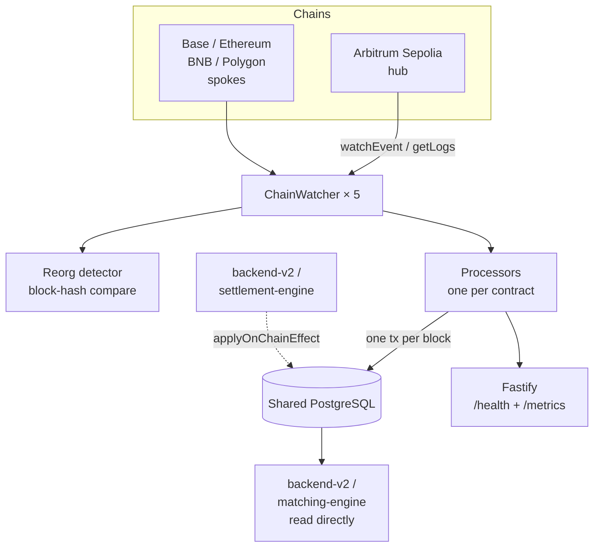

# Centuari · Blockchain Indexer (indexer-v3)

A custom, framework-free blockchain event indexer for the Centuari lending
protocol. It tails contract events across the hub chain (Arbitrum Sepolia) and
four spokes with Viem, and projects them into a shared PostgreSQL schema with
per-block transactional atomicity and reorg safety.

This is one of nine services in the Centuari system. For the big picture, see the
[umbrella README](https://github.com/centuari-labs/centuari).

---

## Why a custom indexer

Ponder and The Graph were both evaluated and rejected. Their enforced
schema/handler model could not express Centuari's core requirement: rolling
multi-chain state (hub + 4 spokes) into a single `user_balance` row, while
staying idempotent with *eager-path* writers (the backend and settlement engine
that update the same rows the instant they send a transaction, before the event
is even mined). So indexer-v3 is a hand-rolled Viem event watcher over a custom
Postgres schema — no subgraphs, no codegen, no framework.

## Tech stack

Node.js 22 · TypeScript (strict, ES2022) · Viem (`watchEvent` / `getLogs`, WS
with HTTP fallback) · raw `pg` · Fastify (ops surface only) · Zod · Pino ·
Biome · Docker · pnpm

## Architecture



### ChainWatcher layer

- **Five watchers in one process** — one `ChainWatcher` per chain. A crash on one
  chain is isolated and does not stop the others.
- Each watcher uses a Viem `PublicClient` with a **WebSocket transport and HTTP
  fallback**.
- A `block_cursor` row per chain tracks `last_block` + `last_block_hash`. On
  restart it replays from `last_block + 1`.
- **All writes for one `(chain, block)` happen in a single `pg` transaction** —
  processor mutations and the cursor advance commit atomically.

### Reorg handling

On every new head, the last *N* stored block hashes are compared against live
RPC. On divergence, rows with `block_number > forkPoint` are deleted and
replayed. Depth is per-chain: **12** (Arbitrum), **64** (Ethereum), **32**
(others). Eager-path rows are evicted by the same mechanism because they carry
`applied_by_block_hash` / `applied_by_block_number`.

### Two-writer idempotency (C10)

The indexer is a *safety-net tail*: the backend and settlement engine eagerly
write the same rows the moment they broadcast a transaction. Both the eager
writers and the indexer call the shared
[`@centuari-labs/on-chain-effects`](https://github.com/centuari-labs/on-chain-effects)
package, which owns both the verify-then-apply wrapper **and** the per-event
upsert SQL. Every mutation stamps four columns — `applied_by_tx_hash`,
`applied_by_log_index`, `applied_by_block_hash`, `applied_by_block_number` — so
that:

1. The upsert SQL is identical *by construction* between eager path and tail.
2. A second apply of the same `tx_hash` is a no-op (idempotent).
3. Reorg eviction can clean up either writer's rows uniformly.

```ts
applyOnChainEffect({
  txHash, expectedEventSelector, expectedArgsPredicate, mutationFn,
}): Promise<{ applied: boolean; reason?: "already_stamped" | "receipt_reverted" | "event_missing" | "args_mismatch" }>
```

## Processors

Ten processors, one per source contract (Phase 1 active set; some decode-only
and dormant pending the deferred cross-chain phase):

| Source event | Processor | Effect |
|---|---|---|
| `BalanceLedger.Credited / Debited` | balance-ledger | `user_balance.available += / -=` |
| `BalanceLedger.CollateralFlagSet` | balance-ledger | `used_as_collateral` + `flagged_at`; dequeues `pending_collateral_flags` |
| `Centuari.*` (Order / Match / Repay / Bond) | centuari | position + bond rows |
| `HubDepositor.Deposit / Payout` | hub-depositor | `deposit_event` rows |
| `HubIntentSettler.DepositConfirmed` | hub-intent-settler | `cross_chain_deposit.state = CREDITED` |
| `WithdrawalRegistry.*` | withdrawal-registry | `withdrawal_request.state` transitions |
| `SpokeDepositGateway.DepositInitiated` | spoke-deposit-gateway | seeds `cross_chain_deposit` |
| `SpokeVaultStable.*` | spoke-vault | spoke custody accounting |
| `SettlementLedger.*` | settlement-ledger | dormant (solver reimbursement, deferred) |
| `HubIntentSettler.SolverFillRegistered` | hub-intent-settler | dormant (solver fast-fill, deferred) |

## Data surface

The indexer exposes **no consumer-facing data API** — only ops endpoints. Every
reader (backend-v2, matching-engine) queries the shared Postgres schema directly
via its own pool. The frontend never talks to the indexer.

| Route | Consumer | Purpose |
|---|---|---|
| `GET /health` | docker healthcheck, ops | per-chain cursor lag (seconds) |
| `GET /metrics` | Prometheus | `indexer_block_lag_seconds`, `indexer_events_processed_total`, `indexer_reorg_depth` |

## Schema ownership

This service **does not own or run migrations**. backend-v2 is the single
migration authority for the shared database; its `genesis_onchain_schema`
migration creates the tables the indexer reads/writes (`user_balance`,
`deposit_event`, `withdrawal_request`, `cross_chain_deposit`, `bond_token`,
`chain_liquidity`, `block_cursor`). **`backend-v2 pnpm run migrate` must run
before indexer-v3 starts.** All timestamps are `TIMESTAMPTZ`; addresses/hashes
are `BYTEA`; token amounts are `NUMERIC(78,0)` (fits uint256).

## Getting started

```bash
# 1. infra + schema (from the umbrella repo / backend-v2)
docker-compose up -d postgres redis nats
#    then, in backend-v2: pnpm run migrate && pnpm run seed

# 2. contract addresses + ABIs
cd smart-contract-revamp && ./bin/sync-to-services.sh   # writes indexer .env.contracts + abi/

# 3. run the indexer
pnpm install
TZ=UTC pnpm run dev        # tsx watch src/index.ts (port 42069)
```

## Commands

```bash
pnpm run dev        # tsx watch src/index.ts
pnpm run build      # tsc
pnpm run start      # node dist/index.js
pnpm run test       # jest (processor units + reorg replay)
pnpm run lint       # biome check --apply
pnpm run typecheck  # tsc --noEmit
```

All commands run with `TZ=UTC` (set by docker-compose; prefix locally).

## Conventions

- **Zod at every boundary** — env, RPC-decoded args. Never trust `unknown`.
- **Raw `pg`, no ORM** — parameterised queries only.
- **Transactional per block** — never `COMMIT` mid-block.
- **Idempotency stamps are mandatory** — a row that can't carry the four
  `applied_by_*` columns doesn't belong in a processor.
- **Pino structured logs**, never `console.log`.
- **Biome** (config shared with backend-v2). Strict TS with
  `noUncheckedIndexedAccess`.

> Note: spoke processors and the LayerZero-confirmed cross-chain path are
> implemented but dormant behind the hub-only launch — Arbitrum Sepolia is the
> only chain exercised today. See the
> [dev-docs](https://github.com/centuari-labs/dev-docs) for the launch plan.
