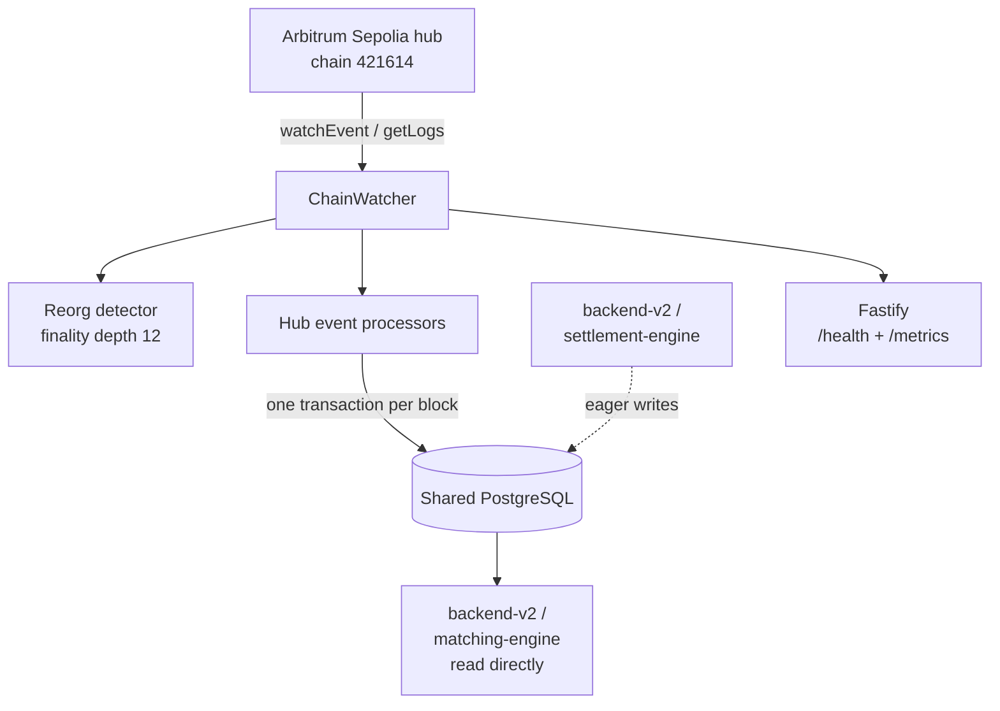

# Centuari · Blockchain Indexer (indexer-v3)

A custom, framework-free blockchain event indexer for the Centuari lending
protocol. The active launch path tails the Arbitrum Sepolia hub (chain
`421614`) with Viem and projects events into the shared PostgreSQL schema with
per-block transactional atomicity, idempotency stamps, and reorg recovery.

This is one of Centuari's core services. For the public system map and current
launch boundary, see the
[umbrella README](https://github.com/centuari-labs/centuari).

> **Current launch:** run this service with `HUB_ONLY=true`. The four spoke
> watchers and cross-chain processors remain implemented for a deferred phase;
> they are not part of the active product launch.

---

## Why a custom indexer

Ponder and The Graph were evaluated and rejected because their enforced
schema/handler model did not fit Centuari's custom PostgreSQL projection and
two-writer idempotency model. indexer-v3 is therefore a hand-rolled Viem event
watcher: no subgraphs, code generation, or indexing framework.

The code can construct one `ChainWatcher` per configured chain, but the launch
configuration constructs only the hub watcher. This keeps the
active deployment focused on Arbitrum Sepolia while preserving a clear seam for
the deferred multi-chain phase.

## Tech stack

Node.js 22 · TypeScript (strict, ES2022) · Viem (`watchEvent` / `getLogs`, WebSocket
with HTTP fallback) · raw `pg` · Fastify (ops surface only) · Zod · Pino · Biome
· Docker · pnpm

## Active architecture



### Chain watcher

- **One watcher in the active process:** the Arbitrum Sepolia hub watcher is
  created when `HUB_ONLY=true`; spoke watchers are skipped entirely.
- The watcher uses a Viem `PublicClient` with a WebSocket transport and HTTP
  fallback.
- A `block_cursor` row tracks the last processed block and block hash. On
  restart, the watcher replays from `last_block + 1`.
- All writes for one `(chain, block)` happen in a single PostgreSQL transaction;
  processor mutations and cursor advancement commit atomically.
- The hub's default finality depth is 12 blocks. On a reorg, rows and recent
  hashes above the fork point are removed for that chain and replayed.

### Deferred multi-chain path

When `HUB_ONLY` is false, the configuration can construct watchers for Base
Sepolia, Ethereum Sepolia, BNB Testnet, and Polygon Amoy. That mode requires
the corresponding `SPOKE_*` RPC, chain, and contract variables. It is deferred
from the current launch and must not be used as the active quickstart.

## Two-writer idempotency (C10)

The indexer is the safety-net tail: `backend-v2` and `settlement-engine` may
write eligible rows eagerly when they submit or confirm a transaction, while
this service applies the same event after it is mined. The shared
[`@centuari-labs/on-chain-effects`](https://github.com/centuari-labs/on-chain-effects)
package owns the mutation SQL. Eager writers use its `applyOnChainEffect`
verify-then-apply wrapper; indexer processors use the same mutation functions
and `isAlreadyStamped` check inside the per-block transaction.

An indexer processor follows this shape:

```ts
const stamp = requireStamps(ctx);
if (!stamp) return;

const decoded = decodeEventLog({
  abi: ABI,
  data: ctx.log.data,
  topics: ctx.log.topics,
});
if (decoded.eventName !== "BorrowPositionCreated") return;

const args = decoded.args as unknown as {
  marketId: Hex;
  borrower: Address;
  principal: bigint;
  debt: bigint;
  rate: bigint;
};
if (
  await isAlreadyStamped(
    ctx.client,
    "borrow_position",
    "market_id = $1 AND borrower = $2",
    [hexToBytea(args.marketId), hexToBytea(args.borrower)],
    stamp,
  )
) {
  return;
}

await applyBorrowPositionCreatedMutation(ctx.client, args, stamp);
```

Every mutation of a stamped row writes `applied_by_tx_hash`,
`applied_by_log_index`, `applied_by_block_hash`, and
`applied_by_block_number`. Replaying the same event is therefore a no-op, and
reorg cleanup can remove rows by source chain and block.

## Processors

The dispatcher registers processors for the hub contract addresses that are
present in the generated `.env.contracts` file. The active hub set includes:

| Source | Examples of projected state |
|---|---|
| `BalanceLedger` | balances, collateral flags, pending-flag cleanup |
| `Centuari` | markets, lend/borrow positions, repayments, liquidation repayments |
| `HubDepositor` | deposits and payout releases |
| `WithdrawalRegistry` | withdrawal lifecycle and chain-liquidity changes |
| `LiquidationEngine` | liquidation and bad-debt events |

The `HubIntentSettler` cross-chain intent events, `SpokeDepositGateway`,
`SpokeVaultStable`, and future settlement-ledger processors are retained in the
codebase for deferred cross-chain behavior. They are not a reason to enable
spoke RPCs in the active launch.

## Data surface

The indexer exposes no consumer-facing data API. It provides operational
endpoints only.
`backend-v2` and `matching-engine` query the shared PostgreSQL schema directly;
the frontend never talks to the indexer.

| Route | Consumer | Purpose |
|---|---|---|
| `GET /health` | Docker healthcheck, ops | overall status and per-chain cursor lag |
| `GET /metrics` | Prometheus | block lag, processed events, and reorg depth |

## Schema ownership

This service **does not own or run migrations**. `backend-v2` is the single
migration authority for the shared database. Its migration set creates the
tables the indexer reads and writes, including `user_balance`, `deposit_event`,
`withdrawal_request`, `cross_chain_deposit`, `bond_token`, `chain_liquidity`,
and `block_cursor`.

Run `backend-v2`'s `pnpm run migrate` before starting indexer-v3. The migration
also provides the chain-scoped `applied_by_chain_id` column required for safe
reorg eviction. All timestamps are `TIMESTAMPTZ`; addresses and hashes are
`BYTEA`; token amounts are `NUMERIC(78,0)`.

## Getting started

The commands below assume sibling checkouts in one workspace. If your clones
are elsewhere, use equivalent paths and keep the same environment names.

### 1. Prepare infrastructure and schema

Provide a local PostgreSQL instance first. The public umbrella repository is
documentation-only and does not ship a shared Compose stack.

Then prepare the shared schema from `backend-v2` using a disposable local/test
database:

```bash
cd ../backend-v2
cp .env.example .env
# Set DATABASE_URL, PRIVY_APP_ID, PRIVY_PROJECT_SECRET, and the Arbitrum
# Sepolia values SUPPORTED_CHAINS=421614 and RPC_421614=<hub-rpc-url>.
# Configure the read-only GitHub Packages token described in step 2 before
# installing either backend-v2 or indexer-v3.
pnpm install
pnpm run migrate
pnpm run seed
```

### 2. Configure the private package and contract artifacts

`@centuari-labs/on-chain-effects` is a private GitHub Packages dependency. The
repository `.npmrc` only maps the scope; before installing, configure a
read-only token with `read:packages` in your user-level `~/.npmrc`. Keep the
token out of this repository, `.env`, shell history, and logs.

Generate the contract address and ABI files from the contract repository:

```bash
cd ../smart-contract-revamp
./bin/sync-to-services.sh --network=arb-sepolia
cd ../indexer-v3
```

The sync script writes the ignored `.env.contracts` and ABI files for this
service. It loads `.env.contracts` before `.env`, so do not edit generated
addresses by hand. To check for drift without writing files, run
`./bin/sync-to-services.sh --network=arb-sepolia --check` from
`smart-contract-revamp`.

### 3. Configure hub-only indexer-v3

No runtime secret is committed. Create `.env` locally from the example and set
the hub-only values below:

```dotenv
DATABASE_URL=postgresql://<user>:<password>@localhost:5432/<database>
PORT=42069
LOG_LEVEL=info
NODE_ENV=development
HUB_ONLY=true
HUB_CHAIN_ID=421614
HUB_RPC_URL_WS=wss://<arbitrum-sepolia-websocket-rpc>
HUB_RPC_URL_HTTP=https://<arbitrum-sepolia-http-rpc>
HUB_START_BLOCK=0
HUB_FINALITY_DEPTH=12
```

With `.env.contracts` generated and the private package token configured:

```bash
pnpm install
TZ=UTC pnpm run dev        # tsx watch src/index.ts (port 42069)
```

Do not set `HUB_ONLY=false` for the active launch. In full multi-chain mode,
the loader expects all four spoke configurations and will connect to those
networks.

## Commands

```bash
pnpm run dev        # tsx watch src/index.ts
pnpm run build      # tsc
pnpm run start      # node dist/index.js
pnpm run test       # Jest processor and reorg tests
pnpm run lint       # biome check --write src
pnpm run format     # biome format --write src
pnpm run typecheck  # tsc --noEmit
```

Integration or operational checks require a configured local database and
RPCs. Never point a local test run at a shared or production database.

## Conventions

- **Zod at every boundary:** validate environment values and RPC-decoded
  arguments; never trust `unknown`.
- **Raw `pg`, no ORM:** use parameterised queries only.
- **Transactional per block:** never commit in the middle of a block.
- **Idempotency stamps are mandatory:** processors must preserve all four
  `applied_by_*` columns when they mutate stamped tables.
- **Pino structured logs**, never `console.log`.
- **Biome** formatting and strict TypeScript with `noUncheckedIndexedAccess`.

All commands run with `TZ=UTC`; all timestamp columns are `TIMESTAMPTZ`.
